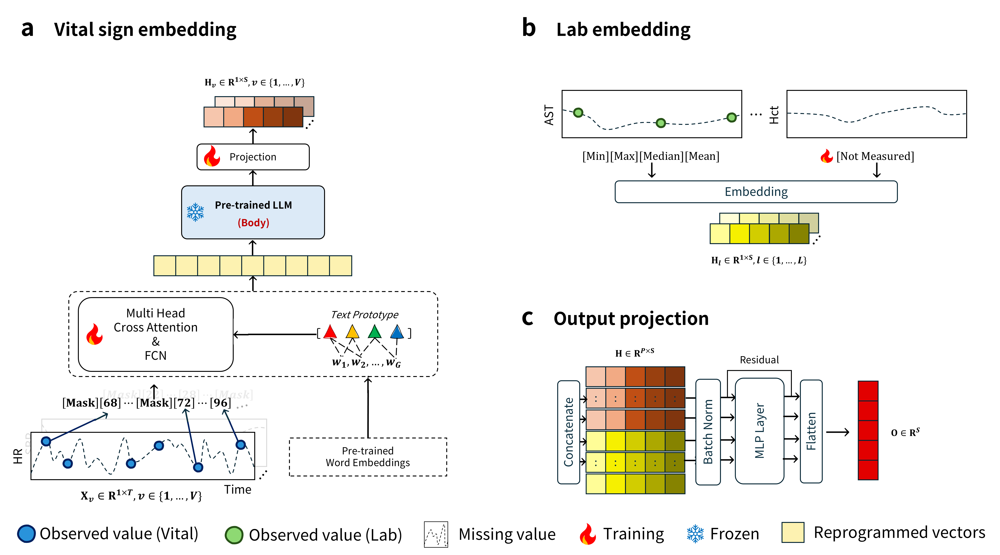
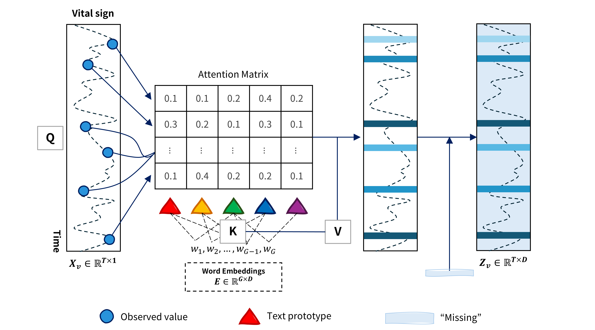

<div align="center">
  <h2><b>Mind the Missing: Variable-Aware Representation Learning for Irregular EHR Time Series using Large Language Models</b></h2>
</div>

<div align="center">

</div>

<div align="center">

**[<a href="https://arxiv.org/abs/2310.01728">Paper Page</a>]**
**[<a href="https://datascience0321.tistory.com/46">Blog</a>]**


</div>

<p align="center">

</p>

---
>
> 🙋 Please let us know if you find out a mistake or have any suggestions!
> 
> 🌟 If you find this resource helpful, please consider to star this repository and cite our research:

<!-- ```
@inproceedings{jin2023time,
  title={{Time-LLM}: Time series forecasting by reprogramming large language models},
  author={Jin, Ming and Wang, Shiyu and Ma, Lintao and Chu, Zhixuan and Zhang, James Y and Shi, Xiaoming and Chen, Pin-Yu and Liang, Yuxuan and Li, Yuan-Fang and Pan, Shirui and Wen, Qingsong},
  booktitle={International Conference on Learning Representations (ICLR)},
  year={2024}
}
``` -->

<!-- ## Updates
🚩 **News** (May 2024): Time-LLM has been included in [NeuralForecast](https://github.com/Nixtla/neuralforecast). Special thanks to the contributor @[JQGoh](https://github.com/JQGoh) and @[marcopeix](https://github.com/marcopeix)!

🚩 **News** (March 2024): Time-LLM has been upgraded to serve as a general framework for repurposing a wide range of language models to time series forecasting. It now defaults to supporting Llama-7B and includes compatibility with two additional smaller PLMs (GPT-2 and BERT). Simply adjust `--llm_model` and `--llm_dim` to switch backbones. -->

## Introduction
VITAL (Variable-aware Irregularly sampled Time series Analysis framework with Large language models), an LLM-based
representation learning framework designed specifically for irregularly sampled EHR time series. Our approach explicitly accounts for variable-level differences in measurement frequency and temporal structure.

This repository is replication of VITAL....


<p align="center">

</p>

- Time-LLM comprises three key components: (1) Vital sign embedding: vital signs are reprogrammed into the language modality and fed into a pre-trained LLM, and (2) Lab embedding: each lab test is embedded as either a representative value or learnable [Not Measured] token, depending on whether it was observed during the observation period. (3) Output projection: the vital sign and lab embeddings are concatenated and summarized into fixed-size vector for downstream tasks.

## Requirements
Use python 3.9 from Anaconda

- torch==2.4.0
- accelerate==0.34.2
- einops==0.7.0
- matplotlib==3.8.2
- numpy==1.26.3
- pandas==2.2.0
- scikit_learn==1.4.0
- scipy==1.12.0
- tqdm==4.67.1
- peft==0.14.0
- transformers==4.47.1
- deepspeed==0.14.4
- wandb==0.18.7


To install all dependencies:
```
pip install -r requirements.txt
```

## Datasets
You can access the P19 from [[2019 PhysioNet Challenge]](https://figshare.com/articles/dataset/P19_dataset_for_Raindrop/19514338?file=34683070) and P12 from [[2012 PhysioNet Challenge]](https://figshare.com/articles/dataset/P12_dataset_for_Raindrop/19514341), then place the downloaded contents under `./dataset`

## Quick Demos
1. Download datasets and place them under `./dataset`
2. Tune the model. We provide five experiment scripts for demonstration purpose under the folder `./code`. For example, you can evaluate on P19 by:

```bash
bash sh scripts.sh 
```

## Further Reading

1, [**Time Series as Images: Vision Transformer for Irregularly Sampled Time Series**](https://arxiv.org/abs/2303.12799), in *NeurIPS* 2023.

**Authors**: Zekun Li, Shiyang Li, Xifeng Yan*

```bibtex
@article{li2023time,
  title={Time series as images: Vision transformer for irregularly sampled time series},
  author={Li, Zekun and Li, Shiyang and Yan, Xifeng},
  journal={Advances in Neural Information Processing Systems},
  volume={36},
  pages={49187--49204},
  year={2023}
}
```

2, [**Graph-guided network for irregularly sampled multivariate time series**](https://arxiv.org/abs/2110.05357), in *ICLR* 2022.

**Authors**: Zhang, Xiang and Zeman, Marko and Tsiligkaridis, Theodoros and Zitnik, Marinka*

```bibtex
@article{zhang2021graph,
  title={Graph-guided network for irregularly sampled multivariate time series},
  author={Zhang, Xiang and Zeman, Marko and Tsiligkaridis, Theodoros and Zitnik, Marinka},
  journal={arXiv preprint arXiv:2110.05357},
  year={2021}
}
```

3, [**Recurrent neural networks for multivariate time series with missing values**](https://arxiv.org/abs/1606.01865), in *Scientific reports* 2018.

**Authors**: Zhengping Che, Sanjay Purushotham, Kyunghyun Cho, David Sontag, Yan Liu

```bibtex
@article{che2018recurrent,
  title={Recurrent neural networks for multivariate time series with missing values},
  author={Che, Zhengping and Purushotham, Sanjay and Cho, Kyunghyun and Sontag, David and Liu, Yan},
  journal={Scientific reports},
  volume={8},
  number={1},
  pages={6085},
  year={2018},
  publisher={Nature Publishing Group UK London}
}
```

4, [**Tsmixer: An all-mlp architecture for time series forecasting**](https://arxiv.org/abs/2303.06053), 2023.
[\[GitHub Repo\]](https://github.com/ditschuk/pytorch-tsmixer)

**Authors**: Si-An Chen, Chun-Liang Li, Nate Yoder, Sercan O. Arik, Tomas Pfister

```bibtex
@article{chen2023tsmixer,
  title={Tsmixer: An all-mlp architecture for time series forecasting},
  author={Chen, Si-An and Li, Chun-Liang and Yoder, Nate and Arik, Sercan O and Pfister, Tomas},
  journal={arXiv preprint arXiv:2303.06053},
  year={2023}
}
```

## Acknowledgement
Our implementation adapts [TimeLLM](https://github.com/KimMeen/Time-LLM) as the code base and have extensively modified it to our purposes. We thank the authors for sharing their implementations and related resources.
